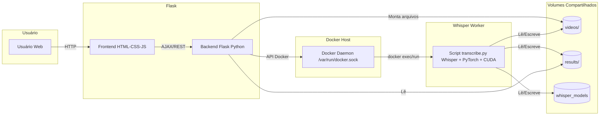
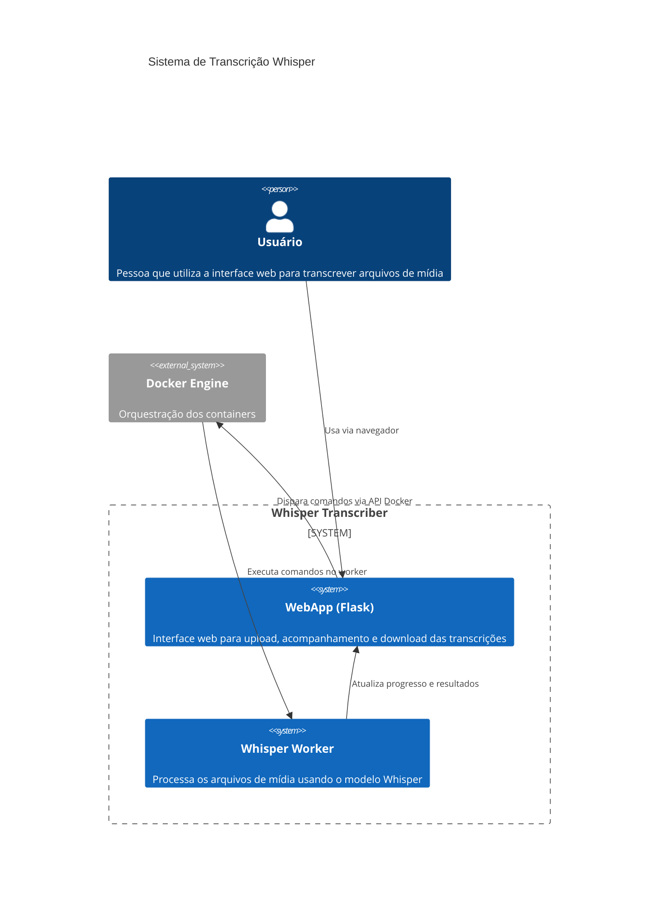
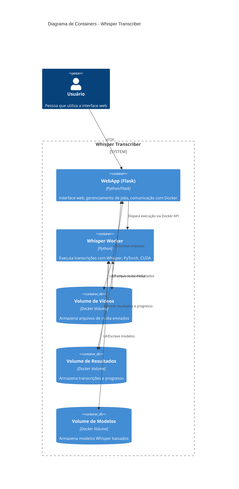
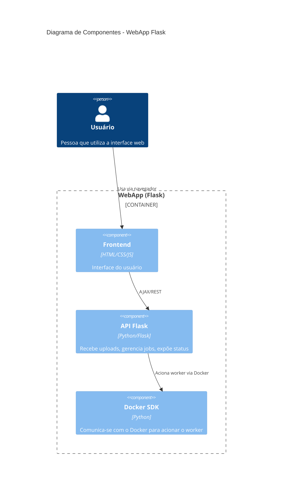
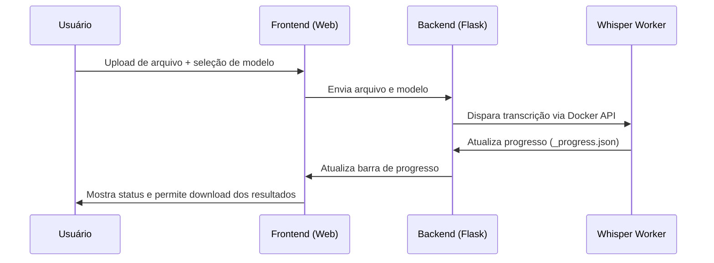

# Stack Tecnológico

## Tecnologias Principais
- **Backend**: Python 3.10+ com framework web Flask
- **Frontend**: HTML, CSS, JavaScript vanilla (sem frameworks)
- **IA/ML**: OpenAI Whisper para transcrição, PyTorch para execução de modelos
- **Containerização**: Docker com orquestração Docker Compose
- **Suporte GPU**: NVIDIA CUDA para processamento acelerado

## Bibliotecas e Dependências Principais
- **Flask**: Framework web e servidor de API
- **docker**: SDK Python para comunicação com API Docker
- **whisper**: Modelo de reconhecimento de fala da OpenAI
- **torch**: PyTorch para operações de deep learning
- **ffmpeg**: Processamento e conversão de arquivos de mídia

## Arquitetura Detalhada

### Visão Geral da Arquitetura


### C4 Model - Diagrama de Contexto


### C4 Model - Diagrama de Container


### C4 Model - Diagrama de Componentes


### Fluxo do Processo de Transcrição


## Sistema de Build e Comandos Comuns

### Configuração Inicial
```bash
# Instalação automática (recomendada)
bash setup.sh                    # Linux/macOS
instalar-windows.bat            # Windows (executar como admin)

# Configuração manual
git clone <repo>
cd transcribe
docker compose up --build -d
```

### Comandos de Desenvolvimento
```bash
# Iniciar serviços
docker compose up --build -d
bash transcriber_web_app/run_local_mvp.sh  # Script alternativo de inicialização

# Visualizar logs
docker compose logs -f                     # Todos os serviços
docker compose logs -f webapp             # Apenas web app
docker compose logs -f whisper_worker     # Apenas worker

# Parar serviços
docker compose down

# Reconstruir containers
docker compose build --no-cache
```

### Gerenciamento de Configuração
```bash
# Visualizar configuração atual
python transcriber_web_app/manage_config.py show

# Definir limite de tamanho de arquivo
python transcriber_web_app/manage_config.py set-size --size 25

# Estimar uso de disco
python transcriber_web_app/manage_config.py estimate-disk --size 25 --jobs 10
```

### Testes

#### Tipos de Testes Disponíveis
- **Testes Locais**: Funcionam sem Docker (validação, rotas básicas, segurança)
- **Testes Completos**: Incluem integração com Docker (upload, processamento)
- **Testes de Saúde**: Verificação de status dos serviços

#### Configuração Inicial
```bash
# Instalar dependências de teste
pip install -r transcriber_web_app/requirements.txt

# Verificar se pytest está instalado
pip install pytest pytest-cov
```

#### Executar Testes
```bash
# Automático (detecta ambiente e executa testes apropriados)
python run_tests.py

# Apenas testes locais (sem Docker)
python run_tests.py --local

# Todos os testes (requer Docker rodando)
python run_tests.py --full

# Testes específicos com pytest
python -m pytest transcriber_web_app/test_app.py -v
python -m pytest transcriber_web_app/test_local.py -v

# Testes com cobertura
python -m pytest transcriber_web_app/test_app.py --cov=transcriber_web_app

# Verificações de saúde dos serviços
python transcriber_web_app/healthcheck.py
```

#### Estrutura dos Testes
- **test_app.py**: Testes completos (incluindo Docker)
- **test_local.py**: Testes que funcionam sem Docker
- **run_tests.py**: Script inteligente para execução de testes
- **healthcheck.py**: Verificação de saúde dos serviços

#### Categorias de Teste
- **Validação de Arquivos**: Extensões permitidas, tamanhos, nomes
- **Rotas e API**: Endpoints, códigos de status, respostas JSON
- **Segurança**: Path traversal, validação de entrada, sanitização
- **Upload**: Processamento de arquivos, validação, erros
- **Configuração**: Variáveis de ambiente, limites, parâmetros

## Variáveis de Ambiente
- `MAX_FILE_SIZE_GB`: Limite de tamanho de arquivo (padrão: 15)
- `FLASK_ENV`: Modo do ambiente (development/production)
- `COMPOSE_PROJECT_NAME`: Identificador do projeto Docker
- `STATUS_POLL_INTERVAL`: Frequência de polling da UI (ms)
- `TRANSCRIPTION_TIMEOUT`: Timeout de processamento (segundos)