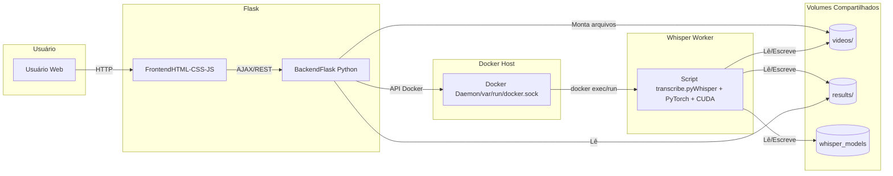
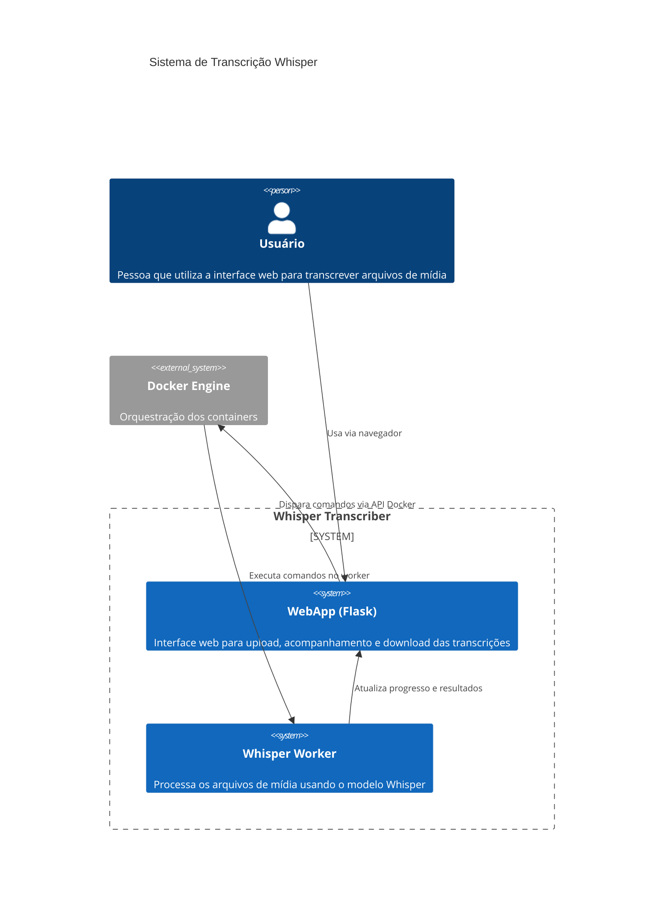
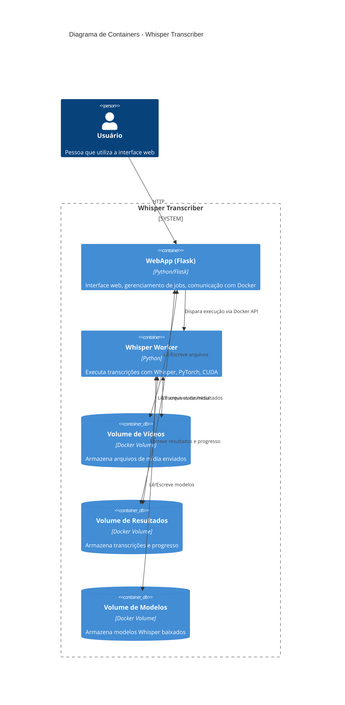
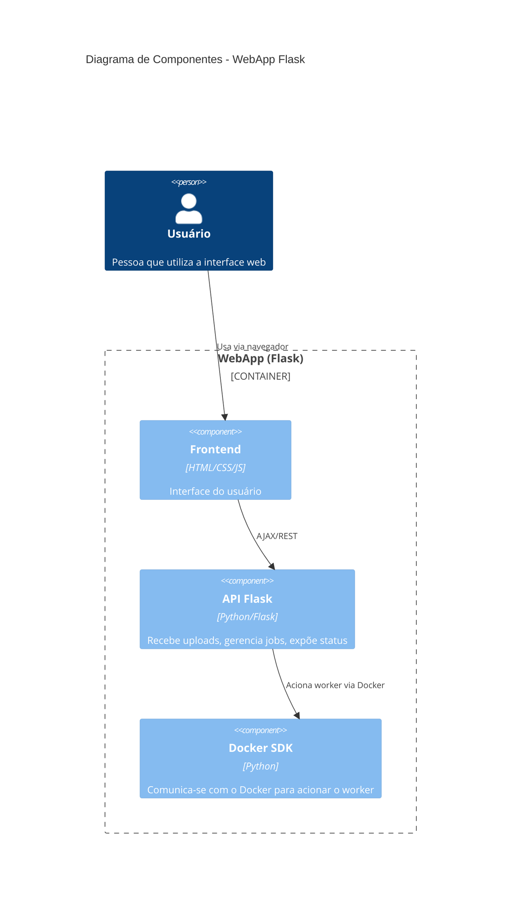
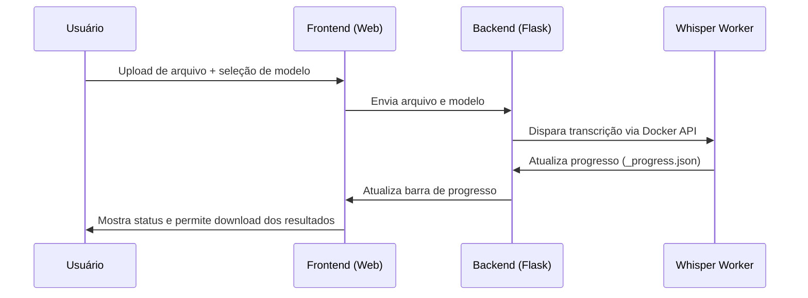

# 🎙️ Whisper Transcriber: Interface Web com Docker Compose

<p align="center">
  <a href="https://github.com/malvesro/transcribe">
    
  </a>
  
  
  
  
  
</p>

## 📄 Sumário

* [Visão Geral](#-visão-geral)
* [Arquitetura da Solução](#-arquitetura-da-solução)
* [Recursos Principais](#-recursos-principais)
* [Pré-requisitos](#-pré-requisitos)
* [Guia de Início Rápido](#-guia-de-início-rápido)
  * [Estrutura do Projeto](#estrutura-do-projeto)
  * [Configuração do Ambiente Host (Opcional)](#configuração-do-ambiente-host-opcional)
  * [Executando a Aplicação](#executando-a-aplicação)
* [Utilizando a Interface Web](#-utilizando-a-interface-web)
* [Detalhes Técnicos dos Componentes](#-detalhes-técnicos-dos-componentes)
  * [`docker-compose.yml`](#docker-composeyml)
  * [Serviço `webapp` (Flask)](#serviço-webapp-flask)
    *   [`transcriber_web_app/Dockerfile.flask`](#transcriber_web_appdockerfileflask)
    *   [`transcriber_web_app/app.py`](#transcriber_web_appapppy)
    *   [`transcriber_web_app/static/`](#transcriber_web_appstatic)
  * [Serviço `whisper_worker`](#serviço-whisper_worker)
    *   [`transcriber_web_app/Dockerfile.whisper`](#transcriber_web_appdockerfilewhisper)
    *   [`transcriber_web_app/transcribe.py`](#transcriber_web_apptranscribepy)
  * [Script Auxiliar `run_local_mvp.sh`](#script-auxiliar-run_local_mvpsh)
* [Considerações de Segurança](#-considerações-de-segurança)
* [Uso via Linha de Comando (Avançado)](#-uso-via-linha-de-comando-avançado)
* [Contribuição](#-contribuição)
* [Licença](#-licença)
* [Contato](#-contato)

---

## 💡 Visão Geral

Este projeto fornece uma solução robusta e amigável para **transcrição de áudio e vídeo utilizando o modelo Whisper da OpenAI**. A arquitetura foi modernizada para usar **Docker Compose**, orquestrando dois serviços principais: uma **interface web intuitiva (Flask)** e um **worker Whisper dedicado** para processamento eficiente.

A interface web permite que usuários façam upload de arquivos de mídia, selecionem o modelo Whisper, acompanhem o progresso da transcrição em tempo real (com uma barra de progresso por etapas) e baixem os resultados nos formatos TXT, SRT e VTT.

O uso do Docker Compose garante isolamento, consistência entre ambientes e facilita a manutenção e futuras evoluções do projeto.

## 🏗️ Arquitetura da Solução

A aplicação é orquestrada pelo `docker-compose.yml` e consiste em:

1.  **Serviço `webapp`:**
    *   **Interface Web (Frontend):** Construída com HTML, CSS e JavaScript puro, servida pelo Flask.
    *   **Servidor de Aplicação (Backend):** Uma aplicação Flask (Python) que gerencia:
        *   Uploads de arquivos de mídia.
        *   Criação e gerenciamento de jobs de transcrição.
        *   Comunicação com o serviço `whisper_worker` através da API Docker (via socket Docker montado) para iniciar as transcrições. A execução do worker é disparada em uma thread separada para não bloquear a interface.
        *   Fornecimento de status de jobs (incluindo progresso por etapas) e download dos arquivos de resultado.
    *   **Dockerfile:** `transcriber_web_app/Dockerfile.flask`.

2.  **Serviço `whisper_worker`:**
    *   **Ambiente de Transcrição:** Contém o modelo Whisper da OpenAI, PyTorch, CUDA (para aceleração por GPU, se disponível), `ffmpeg` e outras dependências necessárias.
    *   **Processamento:** Executa o script `transcriber_web_app/transcribe.py` para realizar a transcrição.
    *   **Relato de Progresso:** O script `transcribe.py` foi modificado para registrar o progresso em etapas em um arquivo `_progress.json` dentro da pasta de resultados do job.
    *   **Dockerfile:** `transcriber_web_app/Dockerfile.whisper`. O container é mantido em execução (com `CMD ["tail", "-f", "/dev/null"]`) para aguardar comandos.

**Comunicação e Dados:**
*   **Volumes Compartilhados:**
    *   `./transcriber_web_app/videos/`: Armazena os arquivos de mídia enviados. Acessível por ambos os serviços.
    *   `./transcriber_web_app/results/`: Armazena os arquivos de transcrição e o arquivo `_progress.json` para cada job. Acessível por ambos os serviços.
*   **Volume Nomeado:**
    *   `whisper_models`: Persiste os modelos Whisper baixados, evitando downloads repetidos entre reinicializações dos containers.
*   **Rede Docker:** Os serviços operam em uma rede Docker customizada, permitindo comunicação interna se necessário no futuro (embora a comunicação atual seja via API Docker do host).

---
### 🗺️ Diagramas de Arquitetura

#### Visão Geral da arquitetura


---
#### C4 Model - Diagrama de Contexto

---
#### C4 Model - Diagrama de Container

---
#### C4 Model - Diagrama de Componentes

---
### 🔄 Fluxo do Processo de Transcrição



---

## ✨ Recursos Principais

*   **Interface Web Moderna e Intuitiva:** Para upload, seleção de modelo, acompanhamento e download.
*   **Barra de Progresso da Transcrição:** Feedback visual do andamento do processo em etapas.
*   **Orquestração com Docker Compose:** Gerenciamento simplificado e robusto dos serviços.
*   **Processamento em Background:** A UI permanece responsiva enquanto as transcrições ocorrem.
*   **Alta Qualidade de Transcrição:** Utiliza os modelos avançados do Whisper da OpenAI.
*   **Suporte a Aceleração por GPU NVIDIA:** Para transcrições significativamente mais rápidas.
*   **Ambiente Isolado e Consistente:** Graças à conteinerização Docker.
*   **Fácil Instalação e Execução:** Com Docker e Docker Compose.

## 📋 Pré-requisitos

1.  **Docker Engine:** Essencial para executar os containers.
    *   Windows/macOS: Recomendado instalar via **Docker Desktop**.
    *   Linux: Instalação direta do Docker Engine.
2.  **Docker Compose:** Para orquestrar os serviços.
    *   **Docker Compose v2 (comando `docker compose`) é preferível.** O script auxiliar tenta detectar a versão correta.
    *   Geralmente incluído no Docker Desktop. No Linux, pode precisar de instalação separada do plugin.
3.  **Para Suporte a GPU (Altamente Recomendado para Performance):**
    *   Placa de vídeo NVIDIA compatível.
    *   Drivers NVIDIA atualizados no sistema operacional host.
    *   **NVIDIA Container Toolkit** (ou `nvidia-docker2` legado) instalado e configurado no host. Isso permite que os containers Docker acessem a GPU.
        *   *Windows com WSL2:* O Docker Desktop geralmente facilita essa integração.
        *   *Linux Nativo:* Siga as [instruções oficiais da NVIDIA](https://docs.nvidia.com/datacenter/cloud-native/container-toolkit/latest/install-guide.html).

## 🚀 Guia de Início Rápido

### Estrutura do Projeto
```
transcribe/
├── docker-compose.yml          # Define os serviços webapp e whisper_worker
├── transcriber_web_app/
│   ├── Dockerfile.flask        # Define a imagem do serviço webapp
│   ├── Dockerfile.whisper      # Define a imagem do serviço whisper_worker
│   ├── app.py                  # Backend Flask da aplicação web
│   ├── requirements.txt        # Dependências Python para o webapp
│   ├── run_local_mvp.sh        # Script auxiliar para iniciar a aplicação
│   ├── static/                 # Arquivos CSS, JS e imagens para o frontend
│   ├── transcribe.py           # Script Python que executa o Whisper
│   ├── videos/                 # (Criada pelo script) Armazena vídeos enviados
│   └── results/                # (Criada pelo script) Armazena resultados das transcrições
│
├── README.md                   # Este guia
└── ... (outros arquivos de configuração e licença)
```

### Configuração do Ambiente Host (Opcional)
Para usuários Windows que necessitam configurar o WSL2 e o ambiente Docker/NVIDIA, os scripts `Instalador_Whisper.ps1` e `setup.sh` (localizados na raiz do projeto, de versões anteriores) podem servir como referência ou ponto de partida. Contudo, para a atual arquitetura Docker Compose, o essencial é ter Docker e Docker Compose funcionais no seu sistema host.

### Executando a Aplicação

1.  **Clone o Repositório:**
    ```bash
    git clone https://github.com/malvesro/transcribe.git
    cd transcribe
    ```

2.  **Inicie os Serviços:**
    *   **Método Recomendado (usando o script auxiliar):**
        O script `run_local_mvp.sh` (localizado em `transcriber_web_app/`) simplifica a inicialização. Ele navega para o diretório raiz do projeto, cria as pastas de volume necessárias e executa `docker compose up`.
        ```bash
        bash transcriber_web_app/run_local_mvp.sh
        ```
    *   **Método Manual (diretamente com Docker Compose):**
        Execute os seguintes comandos a partir do diretório raiz do projeto (`transcribe/`):
        a. Crie as pastas para os volumes (se ainda não existirem):
           ```bash
           mkdir -p ./transcriber_web_app/videos
           mkdir -p ./transcriber_web_app/results
           ```
        b. Suba os serviços (o comando `--build` reconstrói as imagens se necessário, `-d` executa em background):
           ```bash
           # Para Docker Compose v2 (recomendado)
           docker compose up --build -d

           # Ou para Docker Compose v1 (legado, com hífen)
           # docker-compose up --build -d
           ```
    A primeira execução pode levar alguns minutos para construir as imagens Docker.

3.  **Acesse a Interface Web:**
    Abra seu navegador e acesse: [http://localhost:5000](http://localhost:5000)

4.  **Visualizando Logs (útil para depuração):**
    ```bash
    docker compose logs -f               # Logs de todos os serviços em tempo real
    docker compose logs -f webapp        # Logs apenas do serviço webapp
    docker compose logs -f whisper_worker # Logs apenas do serviço whisper_worker
    ```

5.  **Parando a Aplicação:**
    No diretório raiz do projeto (`transcribe/`):
    ```bash
    docker compose down
    ```
    Este comando para e remove os containers. Os volumes de dados no host (como `videos/`, `results/`) e o volume nomeado (`whisper_models`) são preservados.

## 💻 Utilizando a Interface Web

1.  **Página Inicial:** Apresenta o formulário para upload.
2.  **Selecionar Arquivo:** Clique em "Escolher arquivo" e selecione o arquivo de mídia desejado. O nome do arquivo aparecerá abaixo do campo.
3.  **Escolher Modelo:** Selecione o modelo Whisper na lista suspensa (ex: `small`, `medium`, `large`). Modelos maiores oferecem maior precisão, mas exigem mais tempo e recursos computacionais (especialmente VRAM da GPU).
4.  **Transcrever:** Clique no botão "Transcrever Áudio/Vídeo". O upload do arquivo iniciará, e uma barra de progresso mostrará o status do envio.
5.  **Acompanhar Status:** Após o upload, um novo "job" de transcrição aparecerá na seção "Status das Transcrições".
    *   O status inicial será "Iniciado".
    *   Uma **barra de progresso da transcrição** e um texto de status indicarão o andamento do processo em etapas (ex: "Modelo carregado", "Processando com IA...", "Salvando arquivos...").
    *   Um spinner visual também indicará atividade.
6.  **Resultados:** Quando a transcrição for concluída, o status mudará para "Concluído", a barra de progresso atingirá 100%, e links para download dos arquivos de transcrição (`.txt`, `.srt`, `.vtt`) aparecerão.

## ⚙️ Detalhes Técnicos dos Componentes

### `docker-compose.yml`
Este arquivo é o coração da orquestração. Ele define:
*   **Serviços:** `webapp` e `whisper_worker`.
*   **Builds:** Especifica o contexto e o Dockerfile para cada serviço.
*   **Volumes:**
    *   Mapeia `./transcriber_web_app/videos` e `./transcriber_web_app/results` do host para dentro dos containers, permitindo o compartilhamento de arquivos.
    *   Cria um volume nomeado `whisper_models` para persistir os modelos do Whisper baixados em `/root/.cache/whisper` dentro do `whisper_worker`.
    *   Monta o socket Docker (`/var/run/docker.sock`) no `webapp` para permitir que ele use a API Docker.
*   **Portas:** Expõe a porta `5000` do `webapp` para o host.
*   **Variáveis de Ambiente:** Injeta `DOCKER_COMPOSE_PROJECT_NAME` no `webapp` para ajudar na identificação de containers.
*   **Rede:** Define uma rede customizada `transcriber_network` para os serviços.
*   **Recursos de GPU:** Inclui configuração para permitir que o `whisper_worker` utilize GPUs NVIDIA.

### Serviço `webapp` (Flask)

#### `transcriber_web_app/Dockerfile.flask`
*   Baseado na imagem oficial `python:3.10-slim`.
*   Instala dependências de sistema (como `curl` para baixar o GPG do Docker) e o cliente Docker CLI (`docker-ce-cli`).
*   Copia `requirements.txt` e instala as dependências Python (Flask, Docker SDK, etc.).
*   Copia o restante do código da aplicação (`app.py`, `static/`).
*   Define o `WORKDIR` como `/app`, expõe a porta `5000` e define o `CMD` para iniciar o Flask.

#### `transcriber_web_app/app.py`
*   Aplicação Flask que serve o frontend e gerencia a lógica de backend.
*   Usa a biblioteca Python `docker` para se comunicar com o Docker daemon do host (via socket montado).
*   Ao receber um upload, salva o arquivo e inicia uma **nova thread** para executar o comando de transcrição no container `whisper_worker` usando `container.exec_run()`. Isso torna a chamada não bloqueante para a UI.
*   A thread loga a saída (stdout/stderr) do processo worker.
*   O endpoint `/status/<job_id>` lê o arquivo `_progress.json` (criado pelo `transcribe.py`) e os arquivos de resultado final para fornecer o status e o progresso da transcrição.

#### `transcriber_web_app/static/`
Contém os arquivos estáticos do frontend:
*   `index.html`: A estrutura principal da página.
*   `style.css`: Folha de estilos com a aparência moderna da interface.
*   `script.js`: Lógica JavaScript para uploads com XHR (e barra de progresso de upload), polling de status, atualização dinâmica da UI (incluindo a barra de progresso da transcrição e badges de status), e manipulação de eventos.

### Serviço `whisper_worker`

#### `transcriber_web_app/Dockerfile.whisper`
*   Baseado na imagem `nvidia/cuda` para suporte a GPU.
*   Instala `ffmpeg` (essencial para processamento de mídia), Python, e as bibliotecas PyTorch e Whisper.
*   Pré-carrega o modelo `small` do Whisper durante o build da imagem para acelerar o primeiro uso.
*   Copia o script `transcribe.py` para `/app/` no container.
*   Define `CMD ["tail", "-f", "/dev/null"]` para manter o container em execução, aguardando comandos via `exec_run`.

#### `transcriber_web_app/transcribe.py`
*   Script Python executado dentro do `whisper_worker`.
*   Utiliza `argparse` para receber argumentos: `--video` (caminho do arquivo de mídia), `--model` (nome do modelo Whisper) e `--output_dir` (diretório para salvar os resultados).
*   Implementa a função `update_progress(output_dir, percentage, status_text)` que cria/atualiza um arquivo `_progress.json` no `output_dir` com o status atual e a porcentagem de progresso em várias etapas do processo (Iniciando, Carregando Modelo, Processando, Salvando, Concluído/Erro).
*   Realiza a transcrição usando a biblioteca Whisper.
*   Salva os resultados (`.txt`, `.srt`, `.vtt`) no `output_dir` especificado.
*   Retorna código de saída `0` em sucesso e `1` em caso de erros.

### Script Auxiliar `run_local_mvp.sh`
Localizado em `transcriber_web_app/run_local_mvp.sh`, este script Bash simplifica o processo de inicialização:
*   Verifica a disponibilidade do Docker e do Docker Compose (v1 ou v2).
*   Cria as pastas `./transcriber_web_app/videos` e `./transcriber_web_app/results` no host se não existirem.
*   Executa `docker compose up --build -d` a partir do diretório raiz do projeto.
*   Fornece instruções úteis para o usuário sobre como acessar a aplicação, visualizar logs e parar os serviços.

## 🔐 Considerações de Segurança

*   **Socket Docker Montado:** O serviço `webapp` tem o socket Docker (`/var/run/docker.sock`) montado. Isso concede ao container `webapp` privilégios significativos sobre o Docker daemon do host. Embora necessário para a arquitetura atual (onde o `webapp` aciona o `whisper_worker` via API Docker), em um ambiente de produção, essa abordagem deve ser cuidadosamente avaliada e, se possível, substituída por alternativas como uma fila de mensagens (ex: Celery com RabbitMQ/Redis) para desacoplar os serviços e reduzir a superfície de ataque. Para o contexto deste MVP local, é uma solução funcional.
*   **`FutureWarning` do `torch.load`:** Nos logs do `whisper_worker` (visíveis através do `webapp`), você notará um `FutureWarning` sobre `torch.load(..., weights_only=False)`. Isso se refere a uma prática de segurança do PyTorch ao carregar arquivos de modelo. Como estamos usando os modelos oficiais da OpenAI, o risco é considerado baixo. A correção ideal para este aviso ocorreria dentro da própria biblioteca `openai-whisper`. Não são necessárias ações no projeto atualmente, mas é bom estar ciente.

## 🗣️ Uso via Linha de Comando (Avançado)

Para usuários avançados ou para fins de script, é possível executar o `transcribe.py` diretamente no `whisper_worker` usando `docker compose exec`:
1.  Garanta que os serviços estejam ativos: `docker compose up -d`.
2.  Coloque o arquivo de mídia em `./transcriber_web_app/videos/` no host.
3.  Crie um diretório de resultado no host, ex: `mkdir -p ./transcriber_web_app/results/meu_job_cli_01`.
4.  Execute:
    ```bash
    docker compose exec -T whisper_worker python3 /app/transcribe.py \
        --video /data/videos/nome_do_seu_video.mp4 \
        --model small \
        --output_dir /data/results/meu_job_cli_01
    ```
    Os resultados serão salvos em `./transcriber_web_app/results/meu_job_cli_01/` no host.

---

🤝 Contribuição
---------------
Suas contribuições são bem-vindas! Por favor, siga o processo padrão: fork, crie uma branch para sua feature/correção, faça commit das suas mudanças com mensagens claras e abra um Pull Request.

---

📄 Licença
----------
Este projeto está licenciado sob a Licença MIT. Veja o arquivo `LICENSE` para mais detalhes.

---

✉️ Contato
----------
Para dúvidas, sugestões ou problemas, por favor, abra uma "Issue" no repositório GitHub: [https://github.com/malvesro/transcribe/issues](https://github.com/malvesro/transcribe/issues)
