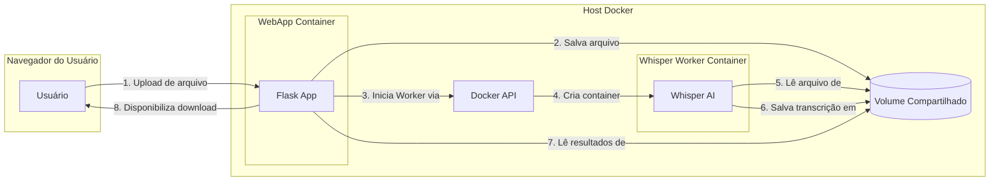

# 🎙️ Whisper Transcriber: Interface Web com Docker Compose

<p align="center">
  <a href="https://github.com/malvesro/transcribe">
    
  </a>
  
  
  
  
  
</p>

## 💡 Visão Geral

Solução web para **transcrição de áudio e vídeo** usando o modelo **Whisper da OpenAI**. Interface intuitiva com upload de arquivos, seleção de modelos, progresso em tempo real e download de resultados em múltiplos formatos (TXT, SRT, VTT).

**Arquitetura**: Docker Compose orquestrando webapp Flask + worker Whisper dedicado.

## 📚 Documentação

Este projeto possui documentação organizada por perfil de usuário e necessidade específica:

### 👤 **Para Usuários Finais**
- **[REQUIREMENTS.md](REQUIREMENTS.md)** - **Requisitos completos do sistema**
  - Compatibilidade de SO, hardware mínimo/recomendado
  - Estimativas de espaço em disco e performance
  - Troubleshooting para problemas comuns
  - *Leia antes de instalar para verificar compatibilidade*

### 🧑‍💻 **Para Desenvolvedores**
- **[TESTING.md](TESTING.md)** - **Guia completo de testes**
  - Como executar testes locais e com Docker
  - Exemplos de como adicionar novos testes
  - Configuração de ambiente de desenvolvimento
  - *Essencial para contribuir com o projeto*

### 🔒 **Para Administradores**
- **[SECURITY.md](transcriber_web_app/SECURITY.md)** - **Diretrizes de segurança**
  - Configurações de produção
  - Boas práticas de segurança
  - Validações e proteções implementadas
  - *Importante para deployments em produção*

### 🛠️ **Scripts e Ferramentas**
- **[instalar-windows.bat](instalar-windows.bat)** / **[setup.sh](setup.sh)** - Instalação automática e inteligente
- **[run_tests.py](run_tests.py)** - Execução inteligente de testes
- **[manage_config.py](transcriber_web_app/manage_config.py)** - Gerenciamento de configurações
- **[example_new_test.py](transcriber_web_app/example_new_test.py)** - Exemplos para desenvolvedores

### 🎯 **Guia de Leitura por Cenário**

| Seu Objetivo | Documentos Recomendados | Ordem de Leitura |
|--------------|-------------------------|-------------------|
| **Usar a ferramenta** | REQUIREMENTS.md → README.md | 1. Verificar requisitos<br>2. Instalar e usar |
| **Desenvolver/Contribuir** | REQUIREMENTS.md → TESTING.md | 1. Configurar ambiente<br>2. Executar testes<br>3. Entender arquitetura |
| **Deploy em produção** | REQUIREMENTS.md → SECURITY.md | 1. Planejar infraestrutura<br>2. Configurar segurança |
| **Resolver problemas** | REQUIREMENTS.md (Troubleshooting) → TESTING.md | 1. Diagnóstico<br>2. Testes para validar |

## 🚀 Início Rápido

### Instalação Automática (Recomendada)
```bash
# Windows (executar como Administrador)
instalar-windows.bat

# Linux/macOS
bash setup.sh
```

**Recursos dos Instaladores:**
- ✅ **Detecção inteligente** - Verifica componentes já instalados
- ✅ **Feedback visual** - Barras de progresso e estimativas de tempo
- ✅ **Atualização automática** - Atualiza projetos existentes
- ✅ **Scripts de conveniência** - Cria `start-whisper.sh`, `stop-whisper.sh`, e `logs-whisper.sh` para facilitar o gerenciamento.

### Instalação Manual
```bash
# 1. Clonar repositório
git clone https://github.com/malvesro/transcribe.git
cd transcribe

# 2. Iniciar serviços
docker compose up --build -d

# 3. Acessar aplicação
# http://localhost:5000
```

## 💻 Como Usar

1. **Acesse**: http://localhost:5000
2. **Upload**: Selecione arquivo de áudio/vídeo
3. **Modelo**: Escolha tamanho do modelo Whisper
4. **Transcrever**: Acompanhe progresso em tempo real
5. **Download**: Baixe resultados em TXT, SRT ou VTT

## 🏗️ Arquitetura

A aplicação utiliza uma arquitetura de microserviços orquestrada pelo Docker Compose, garantindo isolamento e escalabilidade.

### Componentes
- **WebApp (Flask)**: Container responsável por servir a interface web (HTML, CSS, JS), gerenciar uploads de arquivos e se comunicar com o worker.
- **Whisper Worker**: Container dedicado que executa o modelo de transcrição da OpenAI. Ele é iniciado sob demanda pela WebApp e processa os arquivos de forma isolada.
- **Docker Compose**: Ferramenta que define e gerencia os serviços, redes e volumes da aplicação.

### Fluxo de Comunicação
1.  O **Usuário** acessa a interface web e faz o upload de um arquivo.
2.  A **WebApp (Flask)** recebe o arquivo, o salva em um volume compartilhado e valida a requisição.
3.  A **WebApp** utiliza a **API do Docker** para iniciar um novo container **Whisper Worker** sob demanda, passando o caminho do arquivo a ser processado.
4.  O **Whisper Worker** processa o áudio, gera os arquivos de transcrição (TXT, SRT, VTT) e os salva no mesmo volume compartilhado.
5.  A **WebApp** monitora o status do processo e, ao finalizar, disponibiliza os links para download dos resultados para o **Usuário**.

### Diagrama de Fluxo


## ⚙️ Configuração

### Variáveis Principais (.env)
```bash
MAX_FILE_SIZE_GB=15          # Limite de arquivo
FLASK_ENV=development        # Ambiente
TRANSCRIPTION_TIMEOUT=3600   # Timeout (segundos)
```

### Comandos Úteis
```bash
# Scripts de conveniência (criados automaticamente)
./start-whisper.sh           # Iniciar serviços
./stop-whisper.sh            # Parar serviços  
./logs-whisper.sh            # Ver logs em tempo real

# Configuração
python transcriber_web_app/manage_config.py show
python transcriber_web_app/manage_config.py set-size --size 25

# Testes
python run_tests.py

# Docker direto (alternativo)
docker compose up -d         # Iniciar
docker compose down          # Parar
docker compose logs -f       # Logs
```

## 🧪 Testes

```bash
# Automático (detecta ambiente)
python run_tests.py

# Apenas locais (sem Docker)
python run_tests.py --local

# Completos (com Docker)
python run_tests.py --full
```

**Documentação completa**: [TESTING.md](TESTING.md)

## 🔐 Segurança

- Validação de tipos de arquivo
- Sanitização de nomes de arquivo
- Isolamento via containers
- Configurações de produção

**Detalhes**: [SECURITY.md](transcriber_web_app/SECURITY.md)

## 🤝 Contribuição

1. **Fork** o projeto
2. **Clone** seu fork
3. **Leia**: [REQUIREMENTS.md](REQUIREMENTS.md) e [TESTING.md](TESTING.md)
4. **Desenvolva** sua feature
5. **Teste**: `python run_tests.py`
6. **Envie** Pull Request

### Para Desenvolvedores
- **Exemplos de testes**: [example_new_test.py](transcriber_web_app/example_new_test.py)
- **Configuração**: [manage_config.py](transcriber_web_app/manage_config.py)

---

## 📄 Licença

Este projeto está licenciado sob a Licença MIT. Veja o arquivo `LICENSE` para mais detalhes.

## ✉️ Contato

Para dúvidas, sugestões ou problemas, abra uma [Issue](https://github.com/malvesro/transcribe/issues) no repositório GitHub.